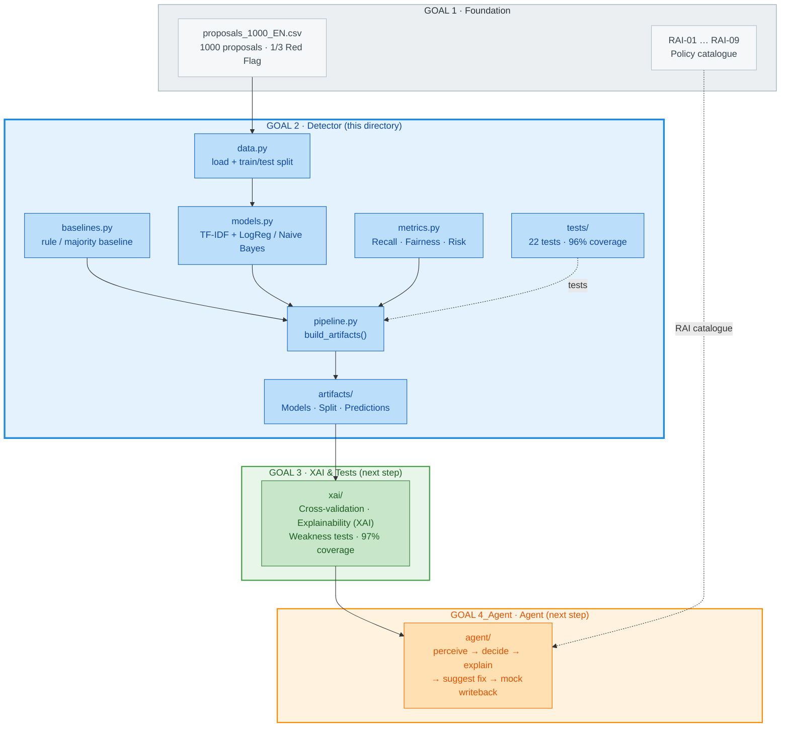

# GOAL 2: Architecture & Context

The Autonomous Compliance Sentinel · Module: Ethics & Responsible AI

This diagram shows **GOAL 2 (the detector)** in detail and - colour-coded -
the **next steps GOAL 3** and **GOAL 4** that build on it.

## Colour legend

| Colour | Area | Status |
|:---:|---|---|
| ⬜ Grey | **GOAL 1** - Data & policy catalogue | Foundation (existing) |
| 🟦 Blue | **GOAL 2** - Detector / model | **this directory** |
| 🟩 Green | **GOAL 3** - XAI & tests | next step |
| 🟧 Orange | **GOAL 4_Agent** - Agent | next step |

## Diagram

## How to read the diagram

1. **GOAL 1 (grey)** provides the data (`proposals_1000_EN.csv`) and the policy catalogue (RAI-01…09).
2. **GOAL 2 (blue)** is the core of this directory: load data -> train models ->
   evaluate -> save as **artifacts**. `build_artifacts()` is the single entry point,
   `tests/` ensures quality.
3. **GOAL 3 (green)** loads the saved GOAL 2 artifacts and adds explainability (XAI)
   and weakness tests - **without retraining**.
4. **GOAL 4_Agent (orange)** builds on GOAL 3 and connects everything into the runnable agent;
   it uses the RAI catalogue from GOAL 1 directly for the fix suggestions (dashed line).

**Chain:** `GOAL 1 -> GOAL 2 -> GOAL 3 -> GOAL 4_Agent`.
GOAL 2 is the model foundation on which GOAL 3 and the agent build.
